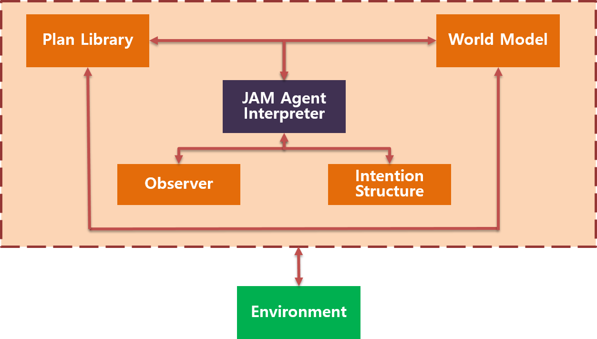
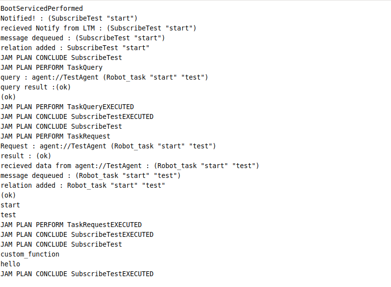

## JAM TUTORIAL

<b><div style="text-align: right"> by 김은지 </div></b>

---

JAM Architecture


> Huber, Marcus J. "JAM: A BDI-theoretic mobile agent architecture." Proceedings of the third annual conference on Autonomous Agents. 1999.


* BDI 기반 JAM Agent

* HRI&RI팀 JAM 실습을 위한 Repository입니다.

---
### Prerequirement

* JAVA (OPENDK-8)
* residis-server
* ArbiFramework m0.8-0.3

---
### Install

```git clone https://github.com/WOWEunji/JAMExample.git ```

---
### Using
1. ArbiFramework Project -> Launcher.java 실행
2. JAM_EXAMPLE/src/taskManager/TaskManager.java 실행
3. TestAgent/src/TestAgent/testagent.java 실행

TaskManager Console

